# 🛠️ Transformação e Processamento de Dados

## 📋 Índice

1. [ETL vs ELT](#etl-vs-elt)
2. [Transformações por Camada](#transformações-por-camada)
3. [Modelagem Dimensional](#modelagem-dimensional)
4. [Data Quality](#data-quality)
5. [Exemplos Práticos](#exemplos-práticos)
6. [Recursos Adicionais](#recursos-adicionais)

## 🔄 ETL vs ELT

### Comparativo de Abordagens


### Características

| Aspecto | ETL | ELT |
|---------|-----|-----|
| Transformação | Antes da carga | Após a carga |
| Escalabilidade | Limitada | Alta |
| Flexibilidade | Baixa | Alta |
| Custo Inicial | Alto | Baixo |
| Complexidade | Alta | Média |
| Reprocessamento | Complexo | Simples |

## 🎯 Transformações por Camada

### Pipeline de Transformação

```mermaid
graph TD
    A[Dados Brutos] --> B[Bronze]
    B --> C[Silver]
    C --> D[Gold]
    
    subgraph "Transformações Bronze"
    B1[Parse] --> B
    B2[Validação Básica] --> B
    B3[Deduplicação] --> B
    end
    
    subgraph "Transformações Silver"
    C1[Limpeza] --> C
    C2[Padronização] --> C
    C3[Enriquecimento] --> C
    end
    
    subgraph "Transformações Gold"
    D1[Agregações] --> D
    D2[Modelagem] --> D
    D3[Métricas] --> D
    end
```



### Exemplo dbt

```yaml
# models/silver/customers_cleaned.sql
{{ config(
    materialized='table',
    schema='silver'
) }}

WITH source AS (
    SELECT * FROM {{ ref('customers_raw') }}
),

cleaned AS (
    SELECT
        id,
        LOWER(TRIM(name)) as name,
        COALESCE(age, 0) as age,
        CASE 
            WHEN country IN ('BR', 'BRA', 'BRAZIL') THEN 'BR'
            ELSE country
        END as country_normalized
    FROM source
    WHERE id IS NOT NULL
)

SELECT * FROM cleaned
```

## 📊 Modelagem Dimensional

### Tipos de Modelos


### Exemplo de Modelagem

```sql
-- Tabela Fato
CREATE TABLE fact_vendas (
    venda_id INT,
    data_id INT,
    produto_id INT,
    cliente_id INT,
    quantidade INT,
    valor_total DECIMAL(10,2),
    FOREIGN KEY (data_id) REFERENCES dim_tempo(data_id),
    FOREIGN KEY (produto_id) REFERENCES dim_produto(produto_id),
    FOREIGN KEY (cliente_id) REFERENCES dim_cliente(cliente_id)
);

-- Dimensão
CREATE TABLE dim_produto (
    produto_id INT PRIMARY KEY,
    nome VARCHAR(100),
    categoria VARCHAR(50),
    preco_unitario DECIMAL(10,2),
    valid_from DATE,
    valid_to DATE
);
```

## ✨ Data Quality

### Framework de Qualidade

```mermaid
graph TD
    A[Data Quality] --> B[Validações]
    A --> C[Monitoramento]
    A --> D[Ações]
    
    subgraph "Tipos de Validação"
    B --> B1[Completude]
    B --> B2[Acurácia]
    B --> B3[Consistência]
    end
    
    subgraph "Monitoramento"
    C --> C1[Métricas]
    C --> C2[Alertas]
    C --> C3[Dashboards]
    end
    
    subgraph "Ações Corretivas"
    D --> D1[Quarentena]
    D --> D2[Correção]
    D --> D3[Notificação]
    end
```



### Exemplo de Testes dbt

```yaml
# models/schema.yml
version: 2

models:
  - name: customers_cleaned
    columns:
      - name: id
        tests:
          - unique
          - not_null
      - name: email
        tests:
          - not_null
          - custom_email_format
      - name: age
        tests:
          - not_null
          - dbt_utils.accepted_range:
              min_value: 0
              max_value: 120

    tests:
      - dbt_utils.unique_combination_of_columns:
          combination_of_columns:
            - id
            - email
```

## 💻 Exemplos Práticos

1. **Transformação com Apache Spark**
```python
from pyspark.sql import SparkSession
from pyspark.sql.functions import *

# Criar sessão Spark
spark = SparkSession.builder \
    .appName("TransformacaoDados") \
    .getOrCreate()

# Ler dados brutos
df_raw = spark.read.format("delta").load("bronze/vendas")

# Transformações
df_cleaned = df_raw \
    .withColumn("data", to_date("data_str")) \
    .withColumn("valor", col("valor").cast("decimal(10,2)")) \
    .dropDuplicates(["id_venda"]) \
    .filter(col("valor") > 0)

# Salvar dados transformados
df_cleaned.write \
    .format("delta") \
    .mode("overwrite") \
    .save("silver/vendas_cleaned")
```

2. **Pipeline dbt**
```yaml
# dbt_project.yml
name: 'transformacao_dados'
version: '1.0.0'

models:
  transformacao_dados:
    staging:
      +materialized: view
      +schema: staging
    
    intermediate:
      +materialized: table
      +schema: intermediate
    
    marts:
      +materialized: table
      +schema: marts
      +tags: ['reporting']
```

## 📚 Recursos Adicionais

- [dbt Documentation](https://docs.getdbt.com/)
- [Apache Spark SQL Guide](https://spark.apache.org/docs/latest/sql-programming-guide.html)
- [Data Quality Best Practices](https://www.montecarlodata.com/blog-data-quality/)
- [Dimensional Modeling Guide](https://www.kimballgroup.com/data-warehouse-business-intelligence-resources/kimball-techniques/dimensional-modeling-techniques/)