# 👮 Governança e Qualidade de Dados

## 📋 Índice

1. [Catálogo de Dados](#catálogo-de-dados)
2. [Linhagem de Dados](#linhagem-de-dados)
3. [Políticas de Acesso](#políticas-de-acesso)
4. [Compliance e LGPD](#compliance-e-lgpd)
5. [Exemplos Práticos](#exemplos-práticos)
6. [Recursos Adicionais](#recursos-adicionais)

## 📚 Catálogo de Dados

### Estrutura do Catálogo

```mermaid
graph TD
    A[Catálogo de Dados] --> B[Metadados]
    A --> C[Documentação]
    A --> D[Classificação]
    
    subgraph "Metadados"
    B --> B1[Técnicos]
    B --> B2[Negócio]
    B --> B3[Operacionais]
    end
    
    subgraph "Documentação"
    C --> C1[Descrições]
    C --> C2[Owners]
    C --> C3[SLAs]
    end
    
    subgraph "Classificação"
    D --> D1[Sensibilidade]
    D --> D2[Qualidade]
    D --> D3[Criticidade]
    end
```



### Exemplo de Configuração

```yaml
# catalog.yml
datasets:
  - name: vendas_diarias
    description: "Dados consolidados de vendas por dia"
    owner: "time_vendas"
    tags:
      - "vendas"
      - "financeiro"
    sensitivity: "confidencial"
    quality_score: 0.95
    update_frequency: "daily"
    columns:
      - name: data_venda
        type: "date"
        description: "Data da venda"
      - name: valor_total
        type: "decimal"
        description: "Valor total da venda"
        sensitivity: "confidencial"
```

## 🔄 Linhagem de Dados

### Visualização de Linhagem

```mermaid
graph LR
    A[Sistema ERP] --> B[Raw Data]
    B --> C[Cleaned Data]
    C --> D[Aggregated Data]
    D --> E[BI Dashboard]
    
    subgraph "Transformações"
    B --> F[Validação]
    F --> G[Enriquecimento]
    G --> H[Agregação]
    end
```



### Exemplo OpenLineage

```python
from openlineage.client import OpenLineageClient
from openlineage.client.run import RunEvent

def report_lineage(job_name, inputs, outputs):
    client = OpenLineageClient()
    
    event = RunEvent(
        eventType="START",
        job={
            "namespace": "data_pipeline",
            "name": job_name
        },
        inputs=[{
            "namespace": "data_lake",
            "name": input
        } for input in inputs],
        outputs=[{
            "namespace": "data_warehouse",
            "name": output
        } for output in outputs]
    )
    
    client.emit(event)
```

## 🔒 Políticas de Acesso

### Framework de Segurança

```mermaid
graph TD
    A[Segurança de Dados] --> B[Autenticação]
    A --> C[Autorização]
    A --> D[Auditoria]
    
    subgraph "Autenticação"
    B --> B1[SSO]
    B --> B2[MFA]
    B --> B3[API Keys]
    end
    
    subgraph "Autorização"
    C --> C1[RBAC]
    C --> C2[ABAC]
    C --> C3[Row-level]
    end
    
    subgraph "Auditoria"
    D --> D1[Logs]
    D --> D2[Alertas]
    D --> D3[Reports]
    end
```



### Exemplo de Políticas

```sql
-- Política de Row-Level Security
CREATE POLICY vendas_access_policy ON vendas
    USING (department_id IN (
        SELECT department_id 
        FROM user_departments 
        WHERE user_id = CURRENT_USER
    ));

-- Mascaramento de Dados
CREATE MASK email_mask ON usuarios
    FOR COLUMN email 
    RETURN CASE 
        WHEN CURRENT_USER = 'admin' THEN email
        ELSE CONCAT(LEFT(email, 2), '***@', 
             SUBSTRING(email FROM '@(.*)$'))
    END;
```

## 📋 Compliance e LGPD

### Framework de Compliance

```mermaid
graph TD
    A[Compliance] --> B[Identificação]
    A --> C[Proteção]
    A --> D[Monitoramento]
    
    subgraph "Identificação"
    B --> B1[PII]
    B --> B2[Sensível]
    B --> B3[Regulatório]
    end
    
    subgraph "Proteção"
    C --> C1[Criptografia]
    C --> C2[Mascaramento]
    C --> C3[Retenção]
    end
    
    subgraph "Monitoramento"
    D --> D1[Auditorias]
    D --> D2[Relatórios]
    D --> D3[Incidentes]
    end
```



### Exemplo de Implementação LGPD

```python
from typing import Dict
import hashlib

class DadosPessoais:
    def __init__(self):
        self.retention_period = {
            "cliente": 365,  # dias
            "funcionario": 730,
            "candidato": 180
        }
    
    def anonimizar(self, dados: Dict) -> Dict:
        """Anonimiza dados sensíveis"""
        if "cpf" in dados:
            dados["cpf"] = hashlib.sha256(
                dados["cpf"].encode()
            ).hexdigest()
        
        if "email" in dados:
            dados["email"] = f"****@{dados['email'].split('@')[1]}"
        
        return dados
    
    def verificar_retencao(self, dados: Dict, tipo: str) -> bool:
        """Verifica se dados devem ser mantidos"""
        from datetime import datetime, timedelta
        
        data_criacao = datetime.fromisoformat(dados["data_criacao"])
        limite = datetime.now() - timedelta(
            days=self.retention_period[tipo]
        )
        
        return data_criacao > limite
```

## 💻 Exemplos Práticos

1. **Configuração de Catálogo com DataHub**
```yaml
# datahub.yml
source:
  type: postgres
  config:
    host_port: localhost:5432
    database: warehouse
    username: ${POSTGRES_USER}
    password: ${POSTGRES_PASSWORD}
    
sink:
  type: datahub-rest
  config:
    server: 'http://localhost:8080'

transformers:
  - type: pattern-classifier
    config:
      patterns:
        email: ".*@.*\\..+"
        phone: "\\+?[0-9]{10,}"
```

2. **Política de Retenção com dbt**
```sql
-- models/governance/data_retention.sql
{{ config(
    materialized='incremental',
    unique_key='id'
) }}

WITH source_data AS (
    SELECT *,
           DATE_ADD(created_at, INTERVAL retention_days DAY) as expiry_date
    FROM {{ ref('raw_data') }}
),

valid_records AS (
    SELECT *
    FROM source_data
    WHERE expiry_date > CURRENT_DATE()
)

SELECT * FROM valid_records
```

## 📚 Recursos Adicionais

- [Apache Atlas Documentation](https://atlas.apache.org/#/)
- [OpenLineage Specification](https://openlineage.io/)
- [LGPD Official Documentation](https://www.gov.br/cidadania/pt-br/acesso-a-informacao/lgpd)
- [Data Governance Best Practices](https://www.collibra.com/blog/data-governance-best-practices)