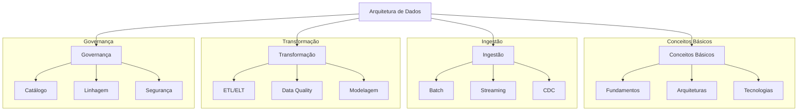

# 📚 Conceitos de Arquitetura e Engenharia de Dados

Este repositório contém uma coleção abrangente de conceitos, práticas e exemplos relacionados à Arquitetura e Engenharia de Dados. O objetivo é fornecer um guia prático e educacional para profissionais e estudantes da área.

## 📋 Índice

1. [Conceitos Básicos](./01-conceitos-basicos)
2. [Ingestão de Dados](./02-ingestao)
3. [Transformação e Processamento](./03-transformacao)
4. [Governança e Qualidade](./04-governanca)

## 🎯 Objetivo

Este repositório tem como objetivo:

- Fornecer uma base sólida de conhecimento em Arquitetura e Engenharia de Dados
- Apresentar exemplos práticos e implementações reais
- Compartilhar melhores práticas e padrões da indústria
- Servir como referência para profissionais e estudantes

## 🛠️ Estrutura



## 🚀 Como Usar

1. Clone o repositório:
```bash
git clone https://github.com/tiagonpsilva/data-arch-eng-concepts.git
```

2. Navegue pelos diretórios para encontrar o conteúdo desejado:
```bash
cd data-arch-eng-concepts
```

3. Cada diretório contém:
- README com explicações detalhadas
- Exemplos práticos em código
- Diagramas e visualizações
- Links para recursos adicionais

## 📚 Recursos Adicionais

- [The Data Engineering Cookbook](https://github.com/andkret/Cookbook)
- [Awesome Data Engineering](https://github.com/igorbarinov/awesome-data-engineering)
- [Data Engineering Roadmap](https://github.com/datastacktv/data-engineer-roadmap)
- [Modern Data Stack](https://www.moderndatastack.xyz/)