# 📚 Conceitos de Arquitetura e Engenharia de Dados

Este repositório contém uma coleção abrangente de conceitos, práticas e exemplos relacionados à Arquitetura e Engenharia de Dados. O objetivo é fornecer um guia prático e educacional para profissionais e estudantes da área.

## 📋 Índice

1. [Conceitos Básicos](./01-conceitos-basicos)
2. [Ingestão de Dados](./02-ingestao)
3. [Transformação e Processamento](./03-transformacao)
4. [Governança e Qualidade](./04-governanca)

## 🎯 Objetivo

Este repositório tem como objetivo:

- Fornecer uma base sólida de conhecimento em Arquitetura e Engenharia de Dados
- Apresentar exemplos práticos e implementações reais
- Compartilhar melhores práticas e padrões da indústria
- Servir como referência para profissionais e estudantes

## 🛠️ Estrutura

```mermaid
graph TD
    A[Arquitetura de Dados] --> B[Conceitos Básicos]
    A --> C[Ingestão]
    A --> D[Transformação]
    A --> E[Governança]
    
    subgraph "Conceitos Básicos"
    B --> B1[Fundamentos]
    B --> B2[Arquiteturas]
    B --> B3[Tecnologias]
    end
    
    subgraph "Ingestão"
    C --> C1[Batch]
    C --> C2[Streaming]
    C --> C3[CDC]
    end
    
    subgraph "Transformação"
    D --> D1[ETL/ELT]
    D --> D2[Data Quality]
    D --> D3[Modelagem]
    end
    
    subgraph "Governança"
    E --> E1[Catálogo]
    E --> E2[Linhagem]
    E --> E3[Segurança]
    end
```



## 🚀 Como Usar

1. Clone o repositório:
```bash
git clone https://github.com/tiagonpsilva/data-arch-eng-concepts.git
```

2. Navegue pelos diretórios para encontrar o conteúdo desejado:
```bash
cd data-arch-eng-concepts
```

3. Cada diretório contém:
- README com explicações detalhadas
- Exemplos práticos em código
- Diagramas e visualizações
- Links para recursos adicionais

## 👥 Contribuição

Contribuições são bem-vindas! Por favor, leia o [guia de contribuição](CONTRIBUTING.md) antes de submeter alterações.

## 📝 Licença

Este projeto está sob a licença MIT - veja o arquivo [LICENSE](LICENSE) para detalhes.

## 📚 Recursos Adicionais

- [The Data Engineering Cookbook](https://github.com/andkret/Cookbook)
- [Awesome Data Engineering](https://github.com/igorbarinov/awesome-data-engineering)
- [Data Engineering Roadmap](https://github.com/datastacktv/data-engineer-roadmap)
- [Modern Data Stack](https://www.moderndatastack.xyz/)